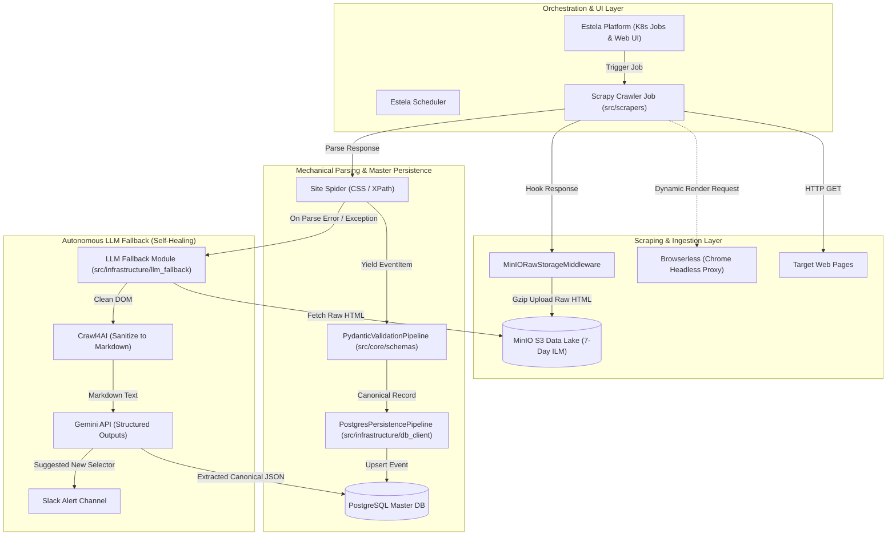

# lumiscrape システムアーキテクチャ

本ドキュメントでは、`lumiscrape` の全体アーキテクチャ、レイヤード設計（Clean Architecture）、データフロー、コンポーネント構成を解説します。

---

## 1. 全体アーキテクチャ図



---

## 2. レイヤード構成 (Clean Architecture)

```text
src/
├── core/                     # 【ドメイン層】Pydantic スキーマ・共通例外 (外部依存なし)
├── infrastructure/           # 【インフラ層】MinIO, PostgreSQL, Crawl4AI, Gemini API
└── scrapers/                 # 【アプリケーション層】Scrapy プロジェクト (Spiders, Middlewares, Pipelines)
```

1. **ドメイン層 (`src/core/`)**:
   - `schemas.py`: システム共通の `EventSchedule` や `ScrapeMetadata` を定義。
   - `exceptions.py`: `ParseError`, `StorageError`, `LLMFallbackError` などのカスタム例外を定義。
2. **インフラ層 (`src/infrastructure/`)**:
   - `minio_client.py`: Gzip 圧縮ストリームでの MinIO アップロードおよび取得。
   - `db_client.py`: PostgreSQL への接続および `event_schedules` テーブルへの Upsert。
   - `llm_fallback/`: `Crawl4AI` による Markdown 化と `Gemini API` による構造化データ抽出およびセレクタ自己修復提案。
3. **アプリケーション層 (`src/scrapers/`)**:
   - `scrapy_project/`: Scrapy Spider と設定ファイル群。インフラ層を呼び出して処理を完結。

---

## 3. データフロー

1. **通常フロー (機械処理)**:
   - Estela が Scrapy Spider を起動。
   - レスポンス受信時に `middlewares.py` が生 HTML を Gzip 圧縮して MinIO に保存。
   - Spider が CSS/XPath セレクタでテキストをパース。
   - `pipelines.py` で Pydantic モデル検証を行い、PostgreSQL に Upsert。
2. **自律的フォールバックフロー (LLM)**:
   - セレクタ破損やパース例外を検知した場合、Spider が `infrastructure/llm_fallback` を呼び出す。
   - `Crawl4AI` で生 HTML のノイズを除去して Markdown に変換。
   - Gemini API に Pydantic スキーマと共に渡し、Structured Outputs で JSON を抽出して PostgreSQL に保存。
   - 同時に修復用セレクタ案を添えて Slack にアラートを通知。
