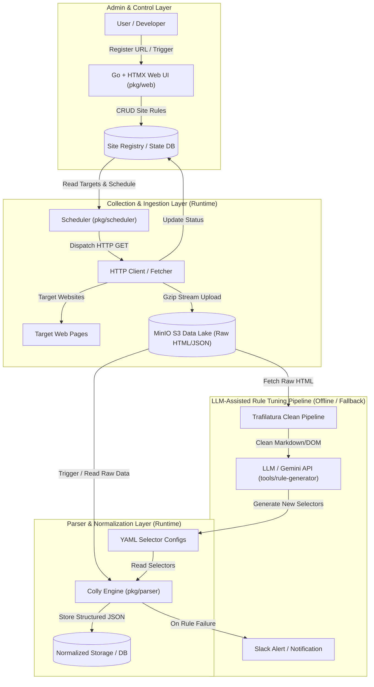

# lumiscrape システムアーキテクチャ

本ドキュメントでは、`lumiscrape` の全体アーキテクチャ、データフロー、コンポーネント構成を解説します。

---

## 1. 全体アーキテクチャ図

---

## 2. データフロー

1. **URL 登録とスケジュール管理**:
   - ユーザーは Go + HTMX の管理画面から対象 URL と Cron スケジュールを登録します。
2. **収集 (Extract & Load)**:
   - スケジューラーが定期的に HTTP GET を実行し、取得した HTML を gzip 圧縮して MinIO に即時保存します。
   - 収集レイヤーはパースを行わないため、高速かつ安定して動作します。
3. **機械的変換 (Transform)**:
   - パーサーエンジン（Colly）が YAML 設定ファイルに定義されたセレクタ（CSS/XPath）に従い、MinIO 内の HTML を構造化データ（JSON）に変換します。
4. **LLM アシスト（チューニング＆フォールバック）**:
   - 新規サイトのルール作成時や、サイト側の構造変更（セレクタ破損）検知時に、Trafilatura でノイズを除去したテキストを LLM に渡し、新しいセレクタ定義を自動生成・提案します。
